TypeScript 类型编程的代码看起来比较复杂，但其实这些逻辑用 JS 大家都会写，之所以到了类型体操就不会了，那是因为还不熟悉一些套路。

所以，这节开始我们就来学习一些类型体操的套路，熟悉这些套路之后，各种类型体操逻辑就能够很顺畅的写出来。

首先，我们来学习类型体操的第一个套路：模式匹配做提取。

## 模式匹配

我们知道，字符串可以和正则做模式匹配，找到匹配的部分，提取子组，之后可以用 1,2 等引用匹配的子组。

Typescript 的类型也同样可以做模式匹配。

比如这样一个 Promise 类型：

```ts
type p = Promise<"tao">;
```

我们想提取 value 的类型，可以这样做：

```ts
type GetValueType<P> = P extends Promise<infer Value> ? Value : never;
```

通过 extends 对传入的类型参数 P 做模式匹配，其中值的类型是需要提取的，通过 infer 声明一个局部变量 Value 来保存，如果匹配，就返回匹配到的 Value，否则就返回 never 代表没匹配到。

这就是 Typescript 类型的模式匹配：

Typescript 类型的模式匹配是通过 extends 对类型参数做匹配，结果保存到通过 infer 声明的局部类型变量里，如果匹配就能从该局部变量里拿到提取出的类型。

这个模式匹配的套路有多有用呢？我们来看下在数组、字符串、函数、构造器等类型里的应用。

## 数组类型

### First

数组类型想提取第一个元素的类型怎么做呢？

```ts
type arr = [1, 2, 3];
```

用它来匹配一个模式类型，提取第一个元素的类型到通过 `infer` 声明的局部变量里返回。

```ts
type GetFirst<Arr extends unknown[]> = Arr extends [infer First, ...unknown[]]
  ? First
  : never;
```

类型参数 Arr 通过 `extends` 约束为只能是数组类型，数组元素是 `unkown` 也就是可以是任何值。

> any 和 unknown 的区别： any 和 unknown 都代表任意类型，但是 unknown 只能接收任意类型的值，而 any 除了可以接收任意类型的值，也可以赋值给任意类型（除了 never）。类型体操中经常用 unknown 接受和匹配任何类型，而很少把任何类型赋值给某个类型变量。

对 Arr 做模式匹配，把我们要提取的第一个元素的类型放到通过 `infer` 声明的 `First` 局部变量里，后面的元素可以是任何类型，用 `unknown` 接收，然后把局部变量 `First` 返回。

- 当类型参数 Arr 为 ['a','b','c'] 时：

  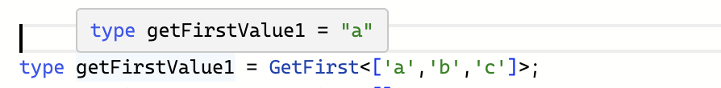

- 当类型参数 Arr 为 [] 时：

  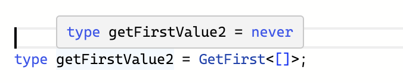

[试一哈](https://www.typescriptlang.org/play?#code/C4TwDgpgBA4hwDECWAnAzsAPAQRSqEAHsBAHYAmaUArqQNakD2A7qQNoC6AfFALxS58REhSpskpAGYR8ydMAA0UAHSraDFuw4coAfihyMUAFxRSEAG4yA3AChboSFADm8Q8ABqAQwA21CACMfLBuqBiYbADkXpEKkQBGsZEAxpHcdg7g0K6IYZ6+-gBMwXC58hHpQA)

### Last

同理，可以提取最后一个元素

```ts
type GetLast<Arr extends unknown[]> = Arr extends [...unknown[], infer Last]
  ? Last
  : never;
```

- 当类型参数 Arr 为 ['a','b','c'] 时：

  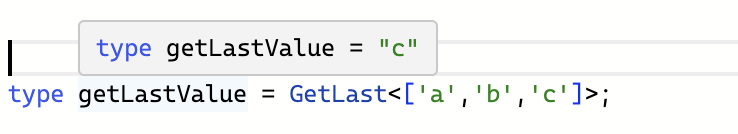

[试一哈](https://www.typescriptlang.org/play?#code/C4TwDgpgBA4hwBkCGBnYAeAggJ21CAHsBAHYAmKUAriQNYkD2A7iQNoC6AfFALxQ55CxcpVYA6CTXrM27ADQBLEgDMIeZGjlR2UAPxQNwKAC4oJCADc1AbgBQ90JCgBzeIYBqSADZVofOIioGKwA5EghciEARhEhAMYhXHZAA)

### PopArr

我们分别取了首尾元素，当然也可以取剩余的数组，比如取去掉了最后一个元素的数组：

```ts
type PopArr<Arr extends unknown[]> = Arr extends []
  ? []
  : Arr extends [...infer Rest, unknown]
  ? Rest
  : never;
```

如果是空数组，就直接返回，否则匹配剩余的元素，放到 infer 声明的局部变量 Rest 里，返回 Rest。

- 当类型参数 Arr 为 [1,2,3] 时：

  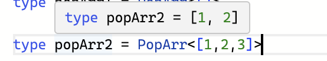

- 当类型参数 Arr 为 [] 时：

  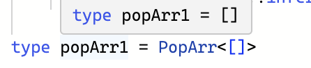

[试一哈](https://www.typescriptlang.org/play?#code/C4TwDgpgBACg9mAggJ2QHhcqEAewIB2AJgM5QCuBA1gXAO4EDaAugHxQC8UAUFH1Jmx5CpKCygB+Mc1785ALgGoh+YmUYA6LQEsCAMwhYAShBLAoAGko16BZpKgmzURQQgA3Q926hIUMAiYAIycsIGoaCys3r7QAUioAEyh8AnojEEWiRYAzGxAA)

### ShiftArr

同理可得 ShiftArr 的实现：

```ts
type ShiftArr<Arr extends unknown[]> = Arr extends []
  ? []
  : Arr extends [unknown, ...infer Rest]
  ? Rest
  : never;
```

- 当类型参数 Arr 为 [1,2,3] 时：

  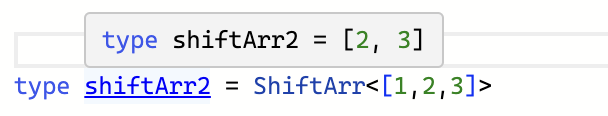

- 当类型参数 Arr 为 [] 时：

  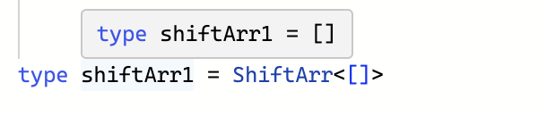
  [试一哈](https://www.typescriptlang.org/play?#code/C4TwDgpgBAygFgSwGbAIICd0B4PqhAD2AgDsATAZygFcSBrEgewHcSBtAXQD4oBeKAFBRhUXPiKlKUTlAD80jkJHKAXKMzji5Km1oMWJADQA6UwhJIIeAEoQKwDnKi37UNSQgA3KwKXLhAqCQUBSIKLgAjHywYWiYWJxcvoHg0KHIcegATNHwGbgJEYZZhgDM3AJAA)

## 字符串类型

---

字符串类型也同样可以做模式匹配，匹配一个模式字符串，把需要提取的部分放到 infer 声明的局部变量里。

### StartWith

判断字符串是否以某个前缀开头，也是通过模式匹配：

```ts
type StartWith<
  Str extends string,
  Prefix extends string
> = Str extends `${Prefix}${string}` ? true : false;
```

- 当匹配时：

  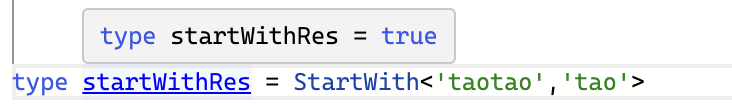

- 不匹配时：

  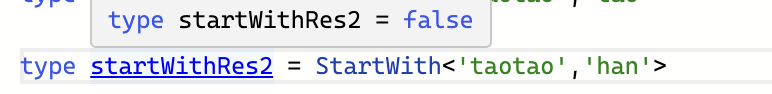

[试一哈](https://www.typescriptlang.org/play?#code/C4TwDgpgBAysCGAnYB1AlsAFgHjoqEAHsBAHYAmAzlJcImqQOYA0ACohAGZqEHFlUadBowB8UALxQAUFDmw6fEhWoADACQBvdlx4BfLbXpM9qqAH4odAK7QAXFE7wANpQjSPoSEKSoMmACUISgBGSQVfdCxsAHIEAHsEmOY4+HiY0U9waFpI-yDKACZwuDzo1MS05JjMeFIMoA)

### Replace

### Trim

能够匹配和替换字符串，那也就能实现去掉空白字符的 Trim：

不过因为我们不知道有多少个空白字符，所以只能一个个匹配和去掉，需要递归。

先实现 TrimRight:

```ts
type TrimRight<Str extends string> = Str extends `${infer Rest}${
  | " "
  | "\n"
  | "\t"}`
  ? TrimRight<Rest>
  : Str;
```

类型参数 Str 是要 Trim 的字符串。

如果 Str 匹配字符串 + 空白字符 (空格、换行、制表符)，那就把字符串放到 infer 声明的局部变量 Rest 里。

把 Rest 作为类型参数递归 TrimRight，直到不匹配，这时的类型参数 Str 就是处理结果。

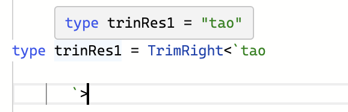

同理可得 TrimLeft：

```ts
type TrimLeft<Str extends string> = Str extends `${
  | " "
  | "\n"
  | "\t"}${infer Rest}`
  ? TrimLeft<Rest>
  : Str;
```

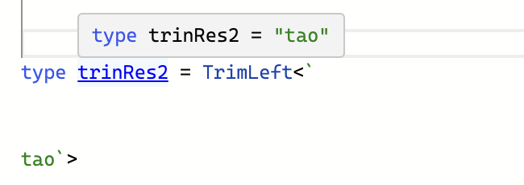

TrimRight 和 TrimLeft 结合就是 Trim：

```ts
type TrimStr<Str extends string> = TrimRight<TrimLeft<Str>>;
```

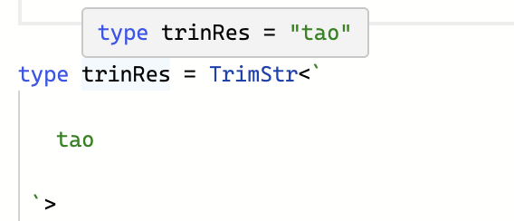

[试一哈](https://www.typescriptlang.org/play?ssl=10&ssc=60&pln=10&pc=1#code/C4TwDgpgBAKgTgSwLYCUEHMAWwA8BlYOKCAD2AgDsATAZyhsIQvQD4oBeKAKCl6gKKly1OgAMAJAG8mAMwhEUEBgF8pAcihqAPmoA6FbXuBrloqAH5ufa7ESoM2HIoZsAXP0JcvoSLeQAZCBlcAWIySlp6RmY2Th4+UKEIsXVNHX1DXWNVaQo5BSVgUwsrG154AKDcZ2A3DzhvcGgKpAF8QjDhSIZEGI4-eyxcFsDg9rgWFniyxt9o5wBGfpa0IZxRYABDAHtp6z2+USnZ6HmlACZlu1HcUS8uLe2j+59T3ucr5Da76ceD3h4zy8QA)

## 函数

---

函数同样也可以做类型匹配，比如提取参数、返回值的类型。

### GetParameters

函数类型可以通过模式匹配来提取参数的类型：

```ts
type GetParameters<Func extends Function> = Func extends (
  ...args: infer Args
) => unknown
  ? Args
  : never;
```

类型参数 Func 是要匹配的函数类型，通过 extends 约束为 Function。

Func 和模式类型做匹配，参数类型放到用 infer 声明的局部变量 Args 里，返回值可以是任何类型，用 unknown。

返回提取到的参数类型 Args。

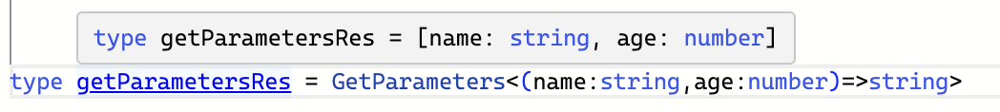

[试一哈](https://www.typescriptlang.org/play?#code/C4TwDgpgBA4hwAUCGAnJBbeEUGcA8AYgK4B2AxlBAB7AQkAmOUx5wAlgPYkB8UAvFABQUEc1IVqtBkwAUAOgWoA5jgBcbEgDNsUAIIoVASj69SAaxIcA7iSgB+PQaaqoJCADdsg76EhQl8MhomLS4AEoQTAJwiKgYWLh4MiTxqjjAKBpKADRIAaokROgARtjG3OmZJErcQA)

### GetReturnType

能提取参数类型，同样也可以提取返回值类型：

```ts
type GetReturnType<Func extends Function> = Func extends (
  ...args: any[]
) => infer ReturnType
  ? ReturnType
  : never;
```

Func 和模式类型做匹配，提取返回值到通过 infer 声明的局部变量 ReturnType 里返回。

参数类型可以是任意类型，也就是 any[]（注意，这里不能用 unknown，这里的解释涉及到参数的逆变性质，具体原因逆变那一节会解释）。

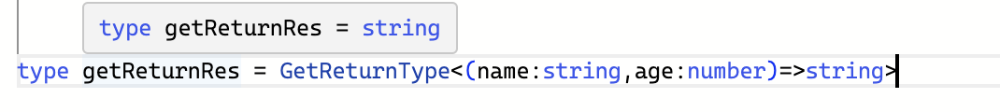

[试一哈](https://www.typescriptlang.org/play?ssl=2&ssc=75&pln=1&pc=1#code/C4TwDgpgBA4hwCV4FcBOA7AKuCAeAYsugMZQQAewE6AJgM5SEnACWA9ugHxQC8UAUFCGMipClVoMAFADo5AQ1QBzOgC556EAG0AugEpe3FugBmEVFCTA0WHEID8llBmyQoqqOggA3c-3+gbkrwVjZIDHxwiM62kLhS6PIAthCqdMCoxkoANPLBqujISQBG5no8nOmZ6EqcQA)

